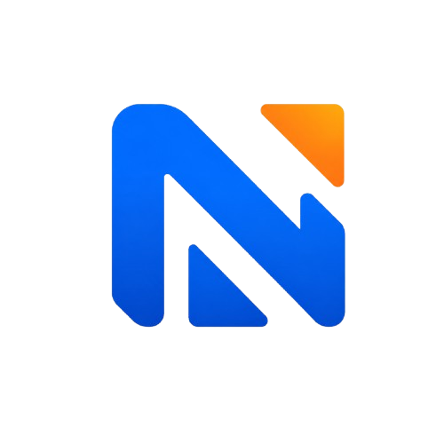
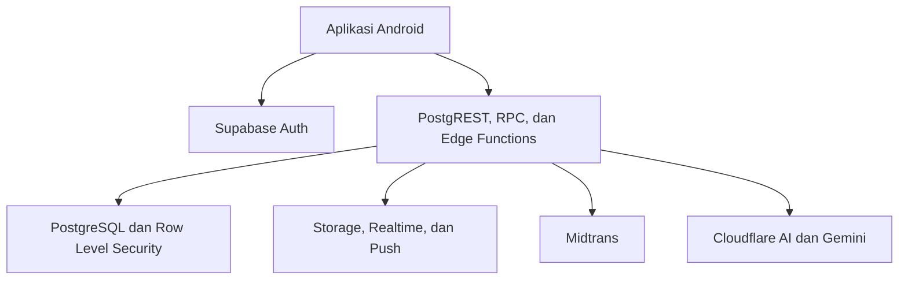

<div align="center">
  

# NiagaCore Mobile

**Platform mPOS Android untuk kasir, stok, keuangan, tim, pembayaran, dan analitik usaha dalam satu ruang kerja.**

[Dokumentasi lengkap](./docs/README.md) · [Changelog](./CHANGELOG.md) · [Kebijakan keamanan](./SECURITY.md) · [MIT License](./LICENSE)


</div>

---

## Tentang project

NiagaCore mobile adalah platform operasional usaha berbasis **React Native + Expo** dengan backend Supabase. Project ini menggabungkan POS, produk, persediaan, pelanggan, pembelian, akuntansi, laporan, pembayaran QRIS, pencairan saldo, pengelolaan tim, notifikasi, dan analitik NIA.

Satu tenant dapat memiliki beberapa usaha dan cabang. Setiap pengguna memperoleh menu serta cakupan data berdasarkan role, usaha, cabang, dan perangkat yang terdaftar. Sistem mendukung kebutuhan retail, F&B, jasa, dan grosir dengan modul yang mengikuti jenis usaha aktif.

> Repository ini berisi aplikasi Android, schema dan fungsi backend Supabase, paket domain bersama, pengujian, workflow rilis, serta website statis distribusi APK. Credential layanan, data production, APK signed, dan konfigurasi akun eksternal tidak disimpan dalam repository.

## Fitur utama

### Kasir dan transaksi

- POS dengan pencarian produk, keranjang, kuantitas, diskon, pajak, dan pemindaian barcode.
- Pembayaran tunai, QRIS Midtrans, serta penjualan kredit dengan pembayaran awal.
- Cicilan piutang pelanggan dan pencatatan nominal yang sudah diterima.
- Draft keranjang tersimpan pada server dan dapat dipulihkan setelah aplikasi dibuka kembali.
- Riwayat transaksi dengan filter tanggal, omzet, visualisasi, detail, cetak, dan berbagi PDF.
- Retur transaksi, disposisi stok, persetujuan refund, dan rekonsiliasi pembayaran.
- Pemulihan sesi QRIS serta kedaluwarsa otomatis untuk pembayaran yang tidak diselesaikan.

### Produk dan operasional

- Produk atau jasa dengan foto, kategori, SKU, barcode, satuan, harga jual, HPP, stok, dan stok minimum.
- Pelanggan, pemasok, purchase order, penerimaan barang, tagihan, dan retur pembelian.
- Stok opname, penyesuaian, transfer antarcabang, lot, kedaluwarsa, dan gudang.
- Modul F&B untuk resep, modifier, meja, serta antrean dapur.
- Modul jasa untuk katalog layanan dan janji temu.
- Shift per pengguna, perangkat, dan cabang dengan kas awal, pergerakan kas, serta penutupan shift.
- Printer melalui dialog cetak Android, scanner kamera, dan pengujian scanner HID.

### Keuangan dan analitik

- Piutang, utang, pengeluaran, jurnal berpasangan, periode akuntansi, aset tetap, dan penyusutan.
- Pengaturan profil pajak, PPN, metode penilaian persediaan, dan ekspor rekonsiliasi pajak.
- Dashboard serta laporan penjualan, laba rugi, neraca, buku besar, arus kas, persediaan, dan aging.
- Laporan cabang aktif atau seluruh cabang dalam usaha yang sedang dipilih.
- Saldo merchant, rekening pencairan terenkripsi, verifikasi rekening, antrean pencairan, dan bukti transfer.
- NIA untuk ringkasan usaha, prediksi, anomali, segmentasi RFM, serta Tanya NiagaCore berbasis dokumen.
- Model registry, versi dataset dan model, pemantauan drift, kalibrasi, serta evaluasi terjadwal.

### Tim dan admin platform

- Multiusaha, multicabang, multiperangkat, dan pergantian ruang kerja dari aplikasi.
- Dua belas role usaha: pemilik, manajer usaha, kepala cabang, supervisor, kasir, gudang, pembelian, keuangan, staf layanan, dapur, pramusaji, dan auditor.
- Undangan staf melalui email, penempatan cabang, pengiriman ulang undangan, dan pencabutan akses.
- MFA/TOTP, PIN perangkat, pencabutan perangkat, permission, RLS, dan jejak aktivitas.
- Control center admin untuk merchant, QRIS, pembayaran, refund, rekening, pencairan, tim admin, rilis, insiden, dukungan, dan kesehatan operasional.
- Push notification untuk kejadian operasional dan sinkronisasi data melalui Realtime dengan polling cadangan.

## Teknologi

| Bagian            | Teknologi                                                   |
| ----------------- | ----------------------------------------------------------- |
| Mobile            | React Native 0.86, React 19                                 |
| Framework         | Expo SDK 57 dan Expo Router                                 |
| Language          | TypeScript 6 strict                                         |
| State dan data    | React Context, Zustand, TanStack Query                      |
| Form dan validasi | React Hook Form dan Zod                                     |
| Backend           | Supabase Edge Functions                                     |
| Database          | PostgreSQL, Row Level Security, RPC, trigger, pgvector      |
| Autentikasi       | Supabase Auth, SecureStore, MFA/TOTP                        |
| Penyimpanan       | Supabase Storage                                            |
| Pembayaran        | Midtrans QRIS, webhook, rekonsiliasi, refund                |
| AI dan analitik   | Cloudflare Workers AI, Gemini, mesin analitik deterministik |
| Notifikasi        | Expo Notifications dan Expo Push Service                    |
| Monitoring        | Sentry, health endpoint, observability spans                |
| Testing           | Vitest, ESLint, TypeScript, pgTAP, Maestro                  |
| Build Android     | EAS Build                                                   |
| CI                | GitHub Actions, Turbo, Dependabot                           |

## Arsitektur



Aplikasi tidak menyimpan server key atau credential provider. Backend menangani otorisasi tenant/cabang, transaksi atomik, pembayaran, webhook, pencairan, jurnal, sinkronisasi, notifikasi, knowledge retrieval, dan pencatatan aktivitas. SecureStore digunakan untuk sesi autentikasi pada perangkat.

## Struktur repository

```text
.
├── .github/                 # CI, Dependabot, dan template kontribusi
├── .maestro/                # Alur pengujian E2E Android
├── apps/
│   ├── distribution-web/    # Halaman distribusi dan manifest APK
│   └── mobile/              # Aplikasi Expo/React Native
├── config/                  # Kontrak database untuk quality gate
├── docs/
│   └── README.md            # Dokumentasi teknis dan penggunaan lengkap
├── packages/                # Accounting, contracts, domain, hardware, i18n, dan UI
├── scripts/                 # Konfigurasi, validasi, backup, dan proses rilis
├── supabase/
│   ├── functions/           # Edge Functions dan webhook
│   ├── migrations/          # Schema, RLS, trigger, dan RPC PostgreSQL
│   └── tests/               # pgTAP dan integration test RLS
├── package.json             # Workspace dan perintah utama
├── pnpm-lock.yaml           # Lockfile dependency
└── README.md                # Halaman depan repository
```

## Persyaratan

- Node.js `22.13.x` sesuai `.nvmrc`.
- pnpm `11.25.0` melalui Corepack.
- Docker dan Supabase CLI untuk backend lokal.
- Android Studio dengan emulator atau perangkat Android.
- Akun EAS untuk cloud build Android.

Integrasi Midtrans, provider AI, Expo Push, dan Sentry membutuhkan akun serta konfigurasi masing-masing.

## Menjalankan secara lokal

Clone repository dan instal dependency:

```bash
git clone <repository-url>
cd <repository-folder>
corepack enable
corepack prepare pnpm@11.25.0 --activate
pnpm install --frozen-lockfile
```

Salin file environment:

```bash
cp .env.example .env
```

Pada Windows PowerShell:

```powershell
Copy-Item .env.example .env
```

Jalankan backend lokal dan terapkan seluruh migrasi:

```bash
supabase start
supabase db reset
```

Jalankan development server:

```bash
pnpm start
```

Nyalakan emulator Android, lalu tekan `a` pada terminal Expo. Untuk emulator Android, gunakan URL Supabase host yang dapat dijangkau emulator, misalnya `http://10.0.2.2:54321`. Gunakan development build untuk pengujian dependency native.

## Environment

| Variable                          | Fungsi                        |
| --------------------------------- | ----------------------------- |
| `EXPO_PUBLIC_SUPABASE_URL`        | URL Supabase untuk aplikasi   |
| `EXPO_PUBLIC_SUPABASE_ANON_KEY`   | Publishable/anon key Supabase |
| `EXPO_PUBLIC_APP_ENV`             | Nama environment aplikasi     |
| `EXPO_PUBLIC_SENTRY_DSN`          | DSN monitoring aplikasi       |
| `EXPO_PUBLIC_RECEIPT_VERIFY_URL`  | URL dasar verifikasi struk    |
| `EXPO_PUBLIC_UPDATE_MANIFEST_URL` | URL manifest pembaruan APK    |

Rahasia backend seperti service-role key, Midtrans server key, kunci enkripsi wallet, token provider AI, dan cron secret disimpan melalui Supabase secrets, EAS environment, atau GitHub Actions secrets.

Daftar variable backend tersedia pada [`.env.example`](./.env.example) dan dijelaskan pada [dokumentasi environment](./docs/README.md#9-konfigurasi-environment).

## Supabase dan admin

Jalankan Supabase lokal:

```bash
supabase start
supabase db reset
supabase test db
```

Tautkan dan terapkan backend ke project Supabase yang telah dikonfigurasi:

```bash
supabase link --project-ref <project-ref>
supabase db push
supabase functions deploy
```

Pemilik usaha dibuat melalui alur onboarding aplikasi. Undangan staf dikelola dari menu **Staf & akses**. Admin platform menggunakan undangan server-side, permission khusus, serta MFA/TOTP. Service-role key tidak digunakan oleh aplikasi mobile.

## Testing

Jalankan quality gate utama:

```bash
pnpm format:check
pnpm lint
pnpm typecheck
pnpm test
pnpm migrations:check
pnpm database:contract
pnpm architecture:check
pnpm release:check
```

Jalankan pengujian database lokal:

```bash
supabase test db
```

Periksa export bundle Android:

```bash
pnpm --filter @niagacore/mobile exec expo export --platform android --clear
```

Pengujian E2E Maestro tersedia melalui workflow **Android Maestro E2E** dan menggunakan APK serta akun staging.

## Build Android

Development build:

```bash
pnpm dlx eas-cli@21.7.0 build --platform android --profile development
```

APK pengujian internal:

```bash
pnpm build:preview
```

APK distribusi production:

```bash
pnpm build:production
```

Workflow **Signed Android release** menjalankan quality gate, EAS Build, verifikasi signature, pemeriksaan versi, perhitungan SHA-256, dan pembaruan manifest distribusi. Gunakan Android signing credential yang sama agar pembaruan dapat dipasang di atas versi sebelumnya.

## Isi repository publik

Repository mencakup source aplikasi mobile, Edge Functions, migrasi dan test database, paket domain, aset yang digunakan, dokumentasi, konfigurasi Expo/EAS, website distribusi, skrip validasi, Maestro flow, serta otomasi GitHub.

File environment lokal, credential, `node_modules`, `.expo`, `.turbo`, `dist`, coverage, log, backup, data pelanggan, source map, ZIP, APK, dan AAB dikecualikan melalui `.gitignore`. Hanya `.env.example` tanpa nilai rahasia yang disertakan sebagai acuan.

## Dokumentasi

Dokumentasi lengkap berada pada:

**[docs/README.md](./docs/README.md)**

Dokumentasi tersebut mencakup fitur, penggunaan, role, arsitektur, konfigurasi, integrasi, model data, API, webhook, keamanan, testing, build, deployment, monitoring, backup, troubleshooting, dan kontribusi.

Dokumentasi menggunakan format Markdown dengan ekstensi `.md`. GitHub akan merendernya menjadi halaman yang dapat dibaca langsung di browser.

## Keamanan

Jangan mengirim laporan kerentanan melalui issue publik. Gunakan proses pelaporan privat pada [SECURITY.md](./SECURITY.md).

Detail arsitektur dan kontrol keamanan tersedia pada [dokumentasi keamanan](./docs/README.md#14-keamanan).

## Kontribusi

Kontribusi dapat dilakukan melalui fork dan pull request:

1. Buat branch yang fokus pada satu perubahan.
2. Pertahankan TypeScript strict serta pola RPC, permission, dan RLS.
3. Tambahkan atau perbarui test sesuai logika yang berubah.
4. Jalankan lint, typecheck, test, pemeriksaan migrasi, dan kontrak database.
5. Jangan mengirim credential, data pelanggan, APK/AAB, atau artifact build.
6. Jelaskan dampak, cara pengujian, perubahan schema, serta tangkapan layar untuk perubahan UI.

Setiap contributor mengikuti [Code of Conduct](./CODE_OF_CONDUCT.md). Perubahan penting dicatat pada [CHANGELOG.md](./CHANGELOG.md).

## Lisensi

Project ini dirilis menggunakan **MIT License**. Source dapat digunakan, dipelajari, dimodifikasi, dan didistribusikan, termasuk untuk penggunaan komersial, dengan tetap menyertakan pemberitahuan hak cipta dan lisensi.

Lihat [LICENSE](./LICENSE) untuk teks lisensi lengkap.

---

<div align="center">
  <sub>NiagaCore · Semua bagian usaha bergerak sebagai satu.</sub>
</div>
